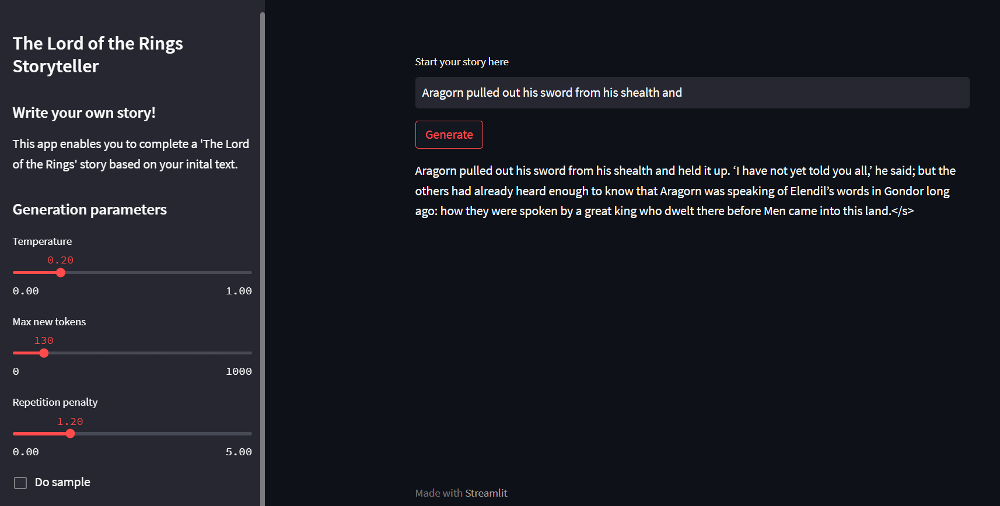

<h1 style='text-align: left '>LOTR Storyteller: the AI of Sauron :mage:</h1>
<h3 style='text-align: left '>Write your own Lord Of The Rings story!</h3>

*Version 1.1 / 23 May 2023*

<p align="center">
  
</p>

# Description

In this project, we have designed an AI assistant that completes your stories in the LOTR style. During the development of the app, we have:
* Extracted the text from the official book,
* Prepared the dataset,
* Trained BLOOM-3B using Low-Rank-Adapters,
* Deployed the model on Inference Endpoints from Hugging Face,
* Built the app using Streamlit,
* Deployed it into Streamlit cloud.

*Notes: regarding the cost of deploying a model this large, the app is not available for testing*

## :gear: Model fine-tuning [[code]](https://github.com/jeremyarancio/llm-rpg/tree/main/llm)

This LLM is fine-tuned on [Bloom-3B](https://huggingface.co/bigscience/bloom-3b) with texts extracted from the book "[The Lord of the Rings](https://gosafir.com/mag/wp-content/uploads/2019/12/Tolkien-J.-The-lord-of-the-rings-HarperCollins-ebooks-2010.pdf)".

Check the article: [Fine-tune your own “GPT-4” on your data: create a “The Lord of the Rings” storyteller](https://medium.com/@jeremyarancio/fine-tune-an-llm-on-your-personal-data-create-a-the-lord-of-the-rings-storyteller-6826dd614fa9)

The Hugging Face model card: [JeremyArancio/llm-tolkien](https://huggingface.co/JeremyArancio/llm-tolkien)

## :rocket: Model deployment and app [[code]](https://github.com/jeremyarancio/llm-rpg/tree/main/src)

The model is deployed on Inference Endpoints from Hugging Face, and the applicaiton is built and deployed on Streamlit.

<p align="center">
  
</p>

# Load the model

```python
from transformers import AutoModelForCausalLM, AutoTokenizer
from peft import PeftConfig, PeftModel

# Import the model
config = PeftConfig.from_pretrained("JeremyArancio/llm-tolkien")
model = AutoModelForCausalLM.from_pretrained(config.base_model_name_or_path, return_dict=True, load_in_8bit=True, device_map='auto')
tokenizer = AutoTokenizer.from_pretrained(config.base_model_name_or_path)
# Load the Lora model
model = PeftModel.from_pretrained(model, "JeremyArancio/llm-tolkien")
```

# Run the model

```python
prompt = "The hobbits were so suprised seeing their friend"

inputs = tokenizer(prompt, return_tensors="pt")
tokens = model.generate(
    **inputs,
    max_new_tokens=100,
    temperature=1,
    eos_token_id=tokenizer.eos_token_id,
    early_stopping=True
)

# The hobbits were so suprised seeing their friend again that they did not 
# speak. Aragorn looked at them, and then he turned to the others.</s>
```

# Training parameters

```python
# Dataset
context_length = 2048

# Training
model_name = 'bigscience/bloom-3b'
lora_r = 16 # attention heads
lora_alpha = 32 # alpha scaling
lora_dropout = 0.05
lora_bias = "none"
lora_task_type = "CAUSAL_LM"

## Trainer config
per_device_train_batch_size = 1 
gradient_accumulation_steps = 1
warmup_steps = 100 
num_train_epochs=3
weight_decay=0.1
learning_rate = 2e-4 
fp16 = True
evaluation_strategy = "no"
```
